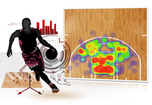

```{r setup, include = FALSE, message = FALSE}
options(htmltools.dir.version = FALSE)

library(deuce)
library(dplyr)
library(tidyr)
library(ggthemes)
library(ggplot2)
library(scales)
library(htmlTable)
library(pitchRx)
library(mgcv)

set.seed(1115808)
```


# Tracking Data




---

# Availability

- Sadly, most tracking data in sport is proprietary

- Luckily, there are some exceptions

- MLB, for instance, made pitch tracking data available from the pitchf/x system for multiple seasons since 2008 

---

# pitchRx

The `pitchRx` package by Carson Sievert provides a way to download and visualize pitchFX data in R.

```{r message = FALSE, eval = FALSE}
install.packages("pitchRx")
```


---

# Pitcher Tracking Data


The `scrape` function is the main resource for importing pitcher tracking data from the pitchFx/Gameday data. The main way to pull data is by indicating the start and end days of interest. Below is an example for extracting pitch information for August 1, 2015. 

```{r message = FALSE}
pitches <- scrape(start = "2015-08-01", end = "2015-08-01")
```

The `start` and `end` must both be in the `yyyy-mm-dd` format.

---

# Results

- The `scrape` function returns an array of 5 data frames

- The data frame of main interest is named `pitch`

- A full glossary of the variables can be found at: https://fastballs.wordpress.com/2007/08/02/glossary-of-the-gameday-pitch-fields/

---

# Visualization

There are three functions for visualizing pitch data from the `pitchRx` package:

- animateFX: 2D pitch trajectory animation

- interactiveFX: 3D pitch trajectory interactive chart

- strikeFX: 2D strike zone chart

---

# Preparing Data

To use any of these visualization functions, we have to combine the `atbat` and `pitch` datasets. Here is an example for inspecting the strike zone in our sample of pitches. 

```{r}
pitch <- pitches$pitch %>%
  select(px, pz, des, gameday_link, num) # Left distance, height, description of pitch

atbat <- pitches$atbat %>%
  select(b_height, p_throws, stand, inning_side, gameday_link, num)

decisions <- inner_join(pitch, atbat, by = c("gameday_link", "num"))
```

---

# Problem: Inspecting Descriptions

- Tabulate the `des` variable

- What codes do we want if we are interested in strikes without a swing?


---

# Solution: Inspecting Descriptions

```{r}
cbind(table(decisions$des))
```


---

# Called Strikes

The `strikeFX` takes `geom` and `density` arguments. We can also add layers as with `ggplot` objects.

```{r, warning = FALSE, message = FALSE, eval = F}
strikeFX(decisions, geom = "tile", 
         density1 = list(des = "Called Strike"),
         density2 = list(des = "Called Strike")) + 
  theme_hc()
```

---

```{r, warning = FALSE, message = FALSE, echo = F}
strikeFX(decisions, geom = "tile", 
         density1 = list(des = "Called Strike"),
         density2 = list(des = "Called Strike")) + 
  theme_hc()
```


---

# Called Strike vs Other Strikes?

Reading a pitch is an essential skill of batters. A `called strike` is a pitch the umpire determines to be in the strike zone but a pitched did not take a swing. Why?

- It could be the pitch count

- It could be they had a bad read on the ball

---

# Modelling Called Strikes

Suppose we want to model what makes a pitch difficult to read? What should such a model consider?

- The trajectory of the ball

- It's speed

- The pitch count

- The handedness of the pitcher

- The handedness of the batter

---

# More Trajectory Data

In addition to the height and horizontal distances of the pitch, let's grab more information about the distances travelled, speed, and accelerations.

```{r}
pitch <- pitches$pitch %>%
  select(px, pz, des, x0:az, gameday_link, num) # Left distance, height, description of pitch

atbat <- pitches$atbat %>%
  select(b_height, p_throws, stand, inning_side, gameday_link, num)

decisions <- inner_join(pitch, atbat, by = c("gameday_link", "num"))
```

---

# Filtering Strikes

Next, we limit the data to strikes and create out outcome variable `called` to denote `Called Strikes`.

```{r}
strikes <- decisions[grep("strike", ignore = T, decisions$des),]

strikes$called <- as.numeric(str_detect(strikes$des, "Called"))

table(strikes$called)
```

---

# GLM 

When looking at the relationship between covariates and an outcome, most of us are used to GLMs. Recall that for any $Y$ that can be described by a member of the exponential family, the GLM model is:

$$g(E(Y | X = x)) = \beta_0 + \sum_{i=1}^p \beta_i x_i$$

where $X$ are our covariates and $g()$ is a link function.

---


# GLM vs GAM

The GLM will not be adequate when modelling trajectories, as we have already seen that the relationship between the physical variables an our outcome is usually complex and non-linear.

A common alternative is the Generalized Additive Model (GAM) which has a similar form as the GLM but with an important difference:

$$g(E(Y | X = x)) = \beta_0 + \sum_{i=1}^p f_i(x_i)$$

where each $f_i(.)$ is a smooth function.

---

# Smooths

- Common types
  - Polynomials
  - Splines

- Tuning parameters
  - Degree, knots
  
- Can be with one variable, interactions, conditional on another variable, etc. (lots of flexibility)

Note: $f_i(.) = \beta_i x_i$ and default back to the parametric form of the GLM

---

# Implementation

- The package `mgcv` provides a comprehensive set of modelling functions for GAMs

- Main functions
  - gam: general-purpose GAM
  - bam: optimized for larger datasets
  - jagam: Bayesian implementation of GAMs

<br>

```{r eval = FALSE}
install.packages('mgcv')
```

---

# Illustration

In this example, we fit a GAM using `bam` for the log odds of `called` strikes as a smooth function of the height of the landing location with 100 knots.

```{r}
fit <- bam(called ~ s(pz, k = 100),
           family = "binomial",
           data = strikes)
```

---

# Diagnostics

The `gam.check` function provides some residual diagnostics to check the appropriateness of the model fit. 

```{r eval = F}
gam.check(fit)
```


---

```{r echo = F}
gam.check(fit)
```


---


# Choosing K

We can also use `gam.check` for assessing the choice of `k`. 

- GAM models have built in penalties to avoid overly complex models

- So the choice of `k` is really about not under-smoothing

- If the k-index is very low, you have likely under-smoothed

---

# Model Summary

```{r}
summary(fit)
```

---

# Expanding the Model

Let's add interactions between the horizontal and vertical height, then fit another model that add a term with interactions in lateral and vertical velocity. 

```{r}
fit1 <- bam(called ~ s(px, pz, k = 100),
           family = "binomial",
           data = strikes)

fit2 <- bam(called ~ s(px, pz, k = 100) + 
               s(vy0, vz0, k = 100),
           family = "binomial",
           data = strikes)
```

---

# Model Selection

After checking the model diagnostics, we can compare the improvement across models using the AIC. Lower AIC indicates an improved fit.

```{r}
AIC(fit, fit1, fit2)
```


---

# Predictions

The `vis.gam` function is especially useful for showing the results of the model fit. Here we look at the predictions for a called strike vs a swinging strike in relation to the position over the plate.

```{r eval = F}
vis.gam(
  fit2,
  plot.type = "contour",
  type = "response"
)
```

---


```{r echo = F}
vis.gam(
  fit2,
  plot.type = "contour",
  type = "response"
)
```

---
  

# Problem: Predictions

1. Use the `view` variable to change the `vis.gam` to show the results in relation to the lateral velocity and vertical height

2. What is your interpretation?


---

# Solution: Predictions

```{r eval = F}
vis.gam(
  fit2,
  view = c("vy0", "pz"),
  plot.type = "contour",
  type = "response"
)
```


---

```{r echo = F}
vis.gam(
  fit2,
  view = c("vy0", "pz"),
  plot.type = "contour",
  type = "response"
)
```

---
  

  
# Resources

- http://cpsievert.github.io/pitchRx/RJwrapper.pdf

- Albert, Jim. Visualizing Baseball. CRC Press, 2017.

