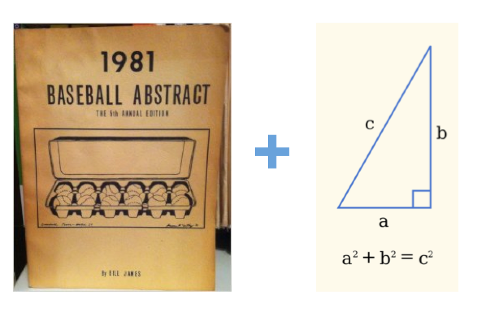
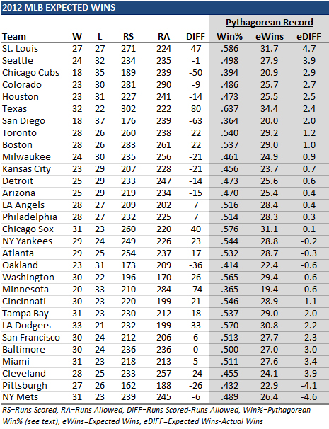

```{r setup, include = FALSE, message = FALSE}
options(htmltools.dir.version = FALSE)

library(dplyr)
library(ggthemes)
library(ggplot2)
library(scales)
library(ggrepel)
library(htmlTable)
```


# Win Expectations

One of the major tasks of a sports statistician is setting expectations for future wins.


---

# Pythagorean Expectation

A simple yet powerful method for estimating win expectations is the _Pythagorean Expectation_.



---

# How It Works?

- Let $PW$ be the total points won by a team and $PL$ be the total points lost

- A generalized Pythagorean Expectation for the team's future wins is:

$$
Win Freq = \frac{PW^\alpha}{PW^\alpha + PL^\alpha}
$$
- In the original Pythagorean Expectation for the MLB, $\alpha = 2$

---

# Illustration




---


# Other Sports

- It turns out that Pythagorean Expectation exists for many sports, team and individual

- Let's have a look at the properties of the formula for the 2016-17 NBA season

--

- But first, we need to get the data!

---

# Problem: NBA 2016-2017 Season Data

Have a look at the following league stats on _Basketball Reference_:

[https://www.basketball-reference.com/leagues/NBA_2017_games-month.html](https://www.basketball-reference.com/leagues/NBA_2017_games-month.html")

What strategy would you use for getting all of the game results for the season?


---

# Solution: Scraping a Single Month

Here we write a function for getting the game scores into a data frame for a given month.

```{r}
nba_scores <- function(url){

	data <- read_html(url) %>% 
		html_nodes("table") %>% 
		html_table()
	
	data <- data[[1]]
	
	data <- data[,c(1, 3:6)]
	
	names(data) <- c("Date", "Visitor", "Visitor.Pts", "Home", "Home.Pts")
	
	result <- rbind(
		data %>% select(Date, Team = Visitor, Opponent = Home, Pts = Visitor.Pts, OpponentPts = Home.Pts),
		data %>% select(Date, Team = Home, Opponent = Visitor, Pts = Home.Pts, OpponentPts = Visitor.Pts)
	)
	
	result$Date <- mdy(result$Date)
	
result
}
```

---

# Solution: Run for All Months

Now we use `lapply` to iterate through all months of the regular season.

```{r message = FALSE, warning = FALSE}
library(stringr)
library(dplyr)
library(lubridate)
library(rvest)

url <- "https://www.basketball-reference.com/leagues/NBA_2017_games-month.html"

# Regular season
months <- tolower(month.name)
months <- months[c(1:3, 10:12)]

urls <- sapply(months, function(x) str_replace(url, "month", x))

data <- do.call("rbind", lapply(urls, nba_scores))
```

---

# Explore Points Won and Lost

Let's look at the total points won and lost for each team over the whole season. Who would you pick as the season leader?

```{r}
data %>%
  group_by(Team) %>%
  dplyr::summarise(
    PtsWon = sum(Pts),
    PtsLost = sum(OpponentPts)
  ) %>%
  ggplot(aes(y = PtsWon, x = PtsLost)) + 
  geom_point(size = 2, col = "#1792d0") + 
  geom_text_repel(aes(label = Team), box.padding = 0.5, 
                  col = "lightgrey") +
  theme_hc()
```

---

# Fitting a Pythagorean Model

Let's look back at the general Pythagorean expectation and do some re-parameterizing.

$$
ProbWin = \frac{PW^\alpha}{PW^\alpha + PL^\alpha}
$$

$$
ProbWin / (1 - ProbWin) = (\frac{PW}{PL})^\alpha
$$

$$
log(ProbWin / (1 - ProbWin)) = \alpha log(PW/PL)
$$

---

# Problem: Model Type

- What does the re-parameterization of the Pythagorean expectation reveal?

- Is there a standard model that is equivalent to the Pythagorean?

- Is it a logistic model?

--

- *Answer:* Not exactly. We have a logistic relationship, but remember that we are looking at a win expectations over the long-term and not individual game outcomes.


---

# Preparing the Data

- Let's use all but the last month of the regular season to fit the Pythagorean model

- Our target outcome is the win frequency 

- The covariates are the cumulative points won and lost for the reference team up to and including the latest game

---


```{r}
# Remove last month of regular season
train_data <- data %>%
  filter(Date < dmy("1-3-2017"))

# Sort by date from earliest to last
train_data <- train_data[order(train_data$Date),]

train_data <- train_data %>%
  group_by(Team) %>%
  dplyr::mutate(
    Match = 1:n(),
    PtsWon = cumsum(Pts),
    PtsLost = cumsum(OpponentPts),
    Won = cummean(Pts > OpponentPts),
    Odds = log(Won / (1 - Won))
  )
```

---

# Fitting the Pythagorean Model

We can use the `glm` function with the `normal` family. This will use a least-squares fit to find $\alpha$. For more stability, we will drop the first 20 matches for each team. 

```{r}
fit <- glm(Odds ~ -1 + log(PtsWon / PtsLost),
           data = train_data %>% filter(Match > 20))
```

---

# Problem: Interpreting Results

- Examine the results from the fitted model

- Do we find evidence of a Pythagorean relationship?

- What is $\alpha$ and how does it differ from the traditional value in baseball? 

---

# Model Performance

Although we can fit the Pythagorean model, determining whether our model is useful is another thing all together.

- Suppose we had fit this model just before the last month of the regular season.

- One thing we might want to do is forecast where each team would end up at the end of the season. 

- We can test how well our model would have done by comparing the expected win expectation with our estimated $\alpha$ against the true value. 

- This is known as a validation test.

---

# Predicted Season End Win Percentage

First, we calculate the Pythagorean forecast for the season end win percentage.

```{r}
prediction_data <- data %>%
  filter(Date < dmy("1-3-2017")) %>%
  group_by(Team) %>%
  dplyr::summarise(
    PtsWon = sum(Pts),
    PtsLost = sum(OpponentPts),
    Predicted = PtsWon^coef(fit) / 
      (PtsWon^coef(fit) + PtsLost^coef(fit))
  )
```

---


# Actual Season End Win Percentage

Next, we calculate the true win frequency and combine the results


```{r}
actual_win <- data %>%
  group_by(Team) %>%
  dplyr::summarise(
    Actual = mean(Pts > OpponentPts)
  )

plot.data <- merge(prediction_data, actual_win, by = "Team")
```

---

# Visualize Agreement

```{r eval = F}
plot.data %>%
  ggplot(aes(y = Predicted * 100, x = Actual * 100)) + 
  geom_point(size = 2, col = "#e5952c") + 
  scale_y_continuous("Predicted Win%", lim = c(0, 100)) +
  scale_x_continuous("Actual Win%",  lim = c(0, 100)) + 
  geom_abline(slope = 1, intercept = 0, col = "lightgrey") + 
  theme_hc() +
  ggtitle("Season-End Performance of NBA Pythagorean Model 2016-2017")
```

---

```{r echo = F}
plot.data %>%
  ggplot(aes(y = Predicted * 100, x = Actual * 100)) + 
  geom_point(size = 2, col = "#e5952c") + 
  scale_y_continuous("Predicted Win%", lim = c(0, 100)) +
  scale_x_continuous("Actual Win%",  lim = c(0, 100)) + 
  geom_abline(slope = 1, intercept = 0, col = "lightgrey") + 
  theme_hc() +
  ggtitle("Season-End Performance of NBA Pythagorean Model 2016-2017")
```

---

# Summary

- The Pythagorean Expectation is a simple yet surprisingly broad method for forecasting long-term win expectations in sport

- We have shown that the Pythagorean implies a logistic relationship between wins and the log ratio of points won and lost 

- Using data from the last season of the NBA we showed how to fit an evaluate the model for a given sport

---

# Resources

- [http://thegamedesigner.blogspot.com.au/2012/05/pythagoras-explained.html](http://thegamedesigner.blogspot.com.au/2012/05/pythagoras-explained.html)

- [https://www.baseballprospectus.com/news/article/342/revisiting-the-pythagorean-theorem-putting-bill-james-pythagorean-theorem-to-the-test/](https://www.baseballprospectus.com/news/article/342/revisiting-the-pythagorean-theorem-putting-bill-james-pythagorean-theorem-to-the-test/)

- Kovalchik, S. A. (2016). Is there a Pythagorean theorem for winning in tennis? Journal of Quantitative Analysis in Sports, 12(1), 43-49.