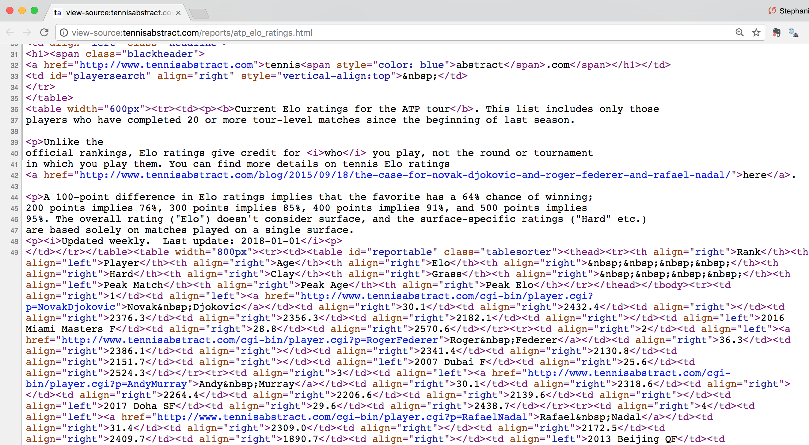
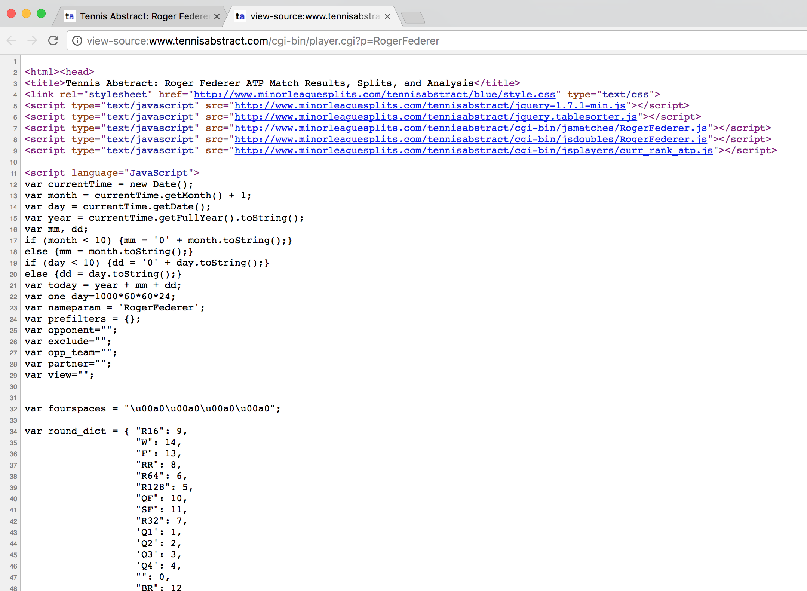
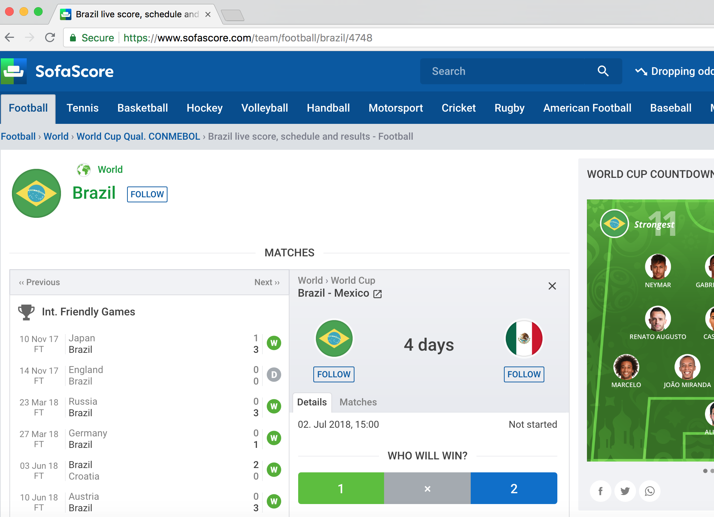
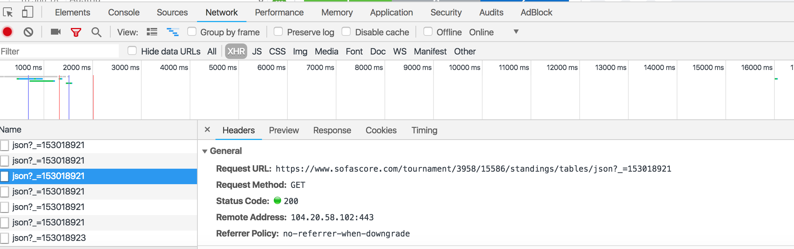

```{r setup, include = FALSE, message = FALSE}
options(htmltools.dir.version = FALSE)

library(RSelenium)
library(htmlTable)
```


# About Me

- Senior Data Scientist for Tennis Australia's Game Insight Group

- Research Fellow at Victoria University

- Tennis Blogger at [on-the-t.com](on-the-t.com)

- @StatsOnTheT


---


# Tutorial Resources

- Github: [github.com/skoval/UseR2018](https://github.com/skoval/UseR2018)

- Contact: [s.a.kovalchik@gmail.com](s.a.kovalchik@gmail.com)

---

# Tutorial Outline

Part 1. Web scraping

--

<i>SOME MODELS FOR SPORTS DATA</i>

Part 2. Paired Comparisons

Part 3. Pythagorean Expectation

Part 4. GAM

Part 5. Forecasting with Bayes


---

# Ways of Getting Sports Data

As a sports statistician you will often need to gather data from the Web. Here are some common ways to get these data:

--

- Importing a data file directly from a Website

--

- Scraping from the underlying source code, which can come in two basic flavors:

  1. Extraction from HTML for static data
  
  2. Importing the underlying data objects for dynamic pages (if possible)
  
  3. Extraction through automated browsing for data that is generated dynamically

---


# Import Data File

--

- Some sites, like [Baseball-Reference.com](http://www.baseball-reference.com), provide tools for creating exportable reports.

--

- In general, we want to avoid manual data collection and automate wherever possible because: *automation = efficiency*

--

- Sports data that is on the Web as an importable file can be imported with `read.table` or similar import function in R if we can determine it's URL

---


# Import Data File

- What are "importable" files? 

--

- Common types include:

--

  - txt
  - csv
  - xls
  - Anything else you can read with `read.table` or specialty imports
  

---


# Example: Import Data File

Here we extract the most recent Australian Open match results and betting odds using `read.csv`.

```{r eval = FALSE}
url <- "http://www.tennis-data.co.uk/2017/ausopen.csv"

read.csv(url)
```

---


# Practice: Import Data File

How do you think you would obtain the same data from the last US Open? 

--

1. Give it a try.

2. Read in the data.

3. Determine the number of matches included.

---


# Solution: Import Data File


```{r}
url <- "http://www.tennis-data.co.uk/2016/usopen.csv"

usopen <- read.csv(url)

nrow(usopen) # Number of matches
```

---


# Web Scraping

.cbox[
### More often you will need to go "under the hood" and work directly with HTML/CSS to extract data from Websites.
]

---


# Inspecting Web Pages


- Before you can extract the data, you need to understand the site design and how the data is contained in it

--

- This means getting familiar with "View Source" and "Developer Tools"

--

- I would recommend getting the "Developer" add-in with Google Chrome, which has an array of tools for inspecting the contents of Web Sites

---


# Viewing Source in Chrome


---


# Practice: Import Data File

1. Navigate to http://www.basketball-reference.com/

2. Use 'View Source' to find where the stats for the 'NBA Standings' are located

3. What is the "id" associated with these data?


---


# Static vs Dynamic Data

.cbox[
### Understanding which tools you need to extract data from a Web site starts with determining if the data is _statically_ or _dynamically_ generated on the site.
]

<br>

Web data is _static_ if you can see it in the source code. If it isn't there, it's _dynamic_.


---

# Practice: Static or Dynamic Data?

1. Have a look at the Tennis Elo Ratings info at the following site:
http://tennisabstract.com/reports/atp_elo_ratings.html

2. Use View Source to determine if the Elo Ratings data are _static_ or _dynamic_.

---

# Solution: It's Static




---

# Practice: Static or Dynamic Data?

1. Now have a look at another _Tennis Astract_ page with stats on Roger Federer:
http://www.tennisabstract.com/cgi-bin/player.cgi?p=RogerFederer

2. Use View Source to determine if the Elo Ratings data are _static_ or _dynamic_.


---

# Solution: It's Dynamic



---


# Scraping Static Data

There are a few options for extracting static HTML data.

1. `readLines` is an option if the data is _not_ nicely formatted, in other words, when there is a lack of structure

2. More typically, the data is _nice_ (e.g. if it is contained in a HTML table or other predictable tag) and we can use scraping packages like `rvest` or `RCurl` to get the data in a format we can work with.

---


# Using `rvest`

--

- Suite of tools for scraping static Web data and putting them in easy-to-use objects (like data.frames)

--

- Works with `magrittr` and allows piping commands with `%>%` operator

--

- Allows some browsing functionality

--

- Authored by Hadley Wickham

---


# Example: Scraping Box Scores

In this example, we will use `rvest` to extract the Eastern Division Standings.

First, we import the page content.

```{r message = FALSE}
library('rvest')

# Creating object with the address
url <- 'http://www.basketball-reference.com/boxscores/'

#Reading the code from the site
webpage <- read_html(url)
```

---


# Example: Scraping Box Scores

The `html_nodes` function is the work horse function for extracting specific elements of a site. We can specify the element we want using its CSS tag or using an XPATH selector.

```{r}
# Using the CSS table tag to get all tables
data <- webpage %>%
   html_nodes(css = 'table') %>%
   html_table()

length(data) # List of multiple tables
```


---


# Example: Scraping Box Scores

Using an XPATH ([XML Path Language](https://en.wikipedia.org/wiki/XPath)) can help to make our extraction more specific, though the syntax is more opaque. 

```{r}
# Using an XPATH selector to get the specific table of interest
data <- webpage %>%
   html_nodes(xpath = '//*[@id="divs_standings_E"]') %>%
   html_table(header = T)

head(data[[1]])
```


---


# Practice: Static Data Extraction

Let's go back to the Elo ratings of male tennis players: [Tennis Abstract Elo](http://tennisabstract.com/reports/atp_elo_ratings.html)

--

1. Use your View Source tools to determine the element containing the ratings

2. Use `rvest` to scrape the data as efficiently as you can

---


# Solution: Elo Rating Extraction


---


# Solution: Elo Rating Extraction

```{r}
url <- "http://tennisabstract.com/reports/atp_elo_ratings.html"

page <- read_html(url)

# Use table class to extract Elo table
elo <- page %>%
    html_nodes("table.tablesorter") %>%
    html_table()

head(elo)
```

---

# Handling Dynamic Data 

- Because dynamic data is created on-the-fly we can't simply read from the HTML to get those data

--

- There are <b>two</b> main ways we can deal with this:

  1. Sleuth the underlying data objects
  
  2. Use automated browsing to make the dynamic problem a static problem

---

# Sleuthing

.pull-left[
- Dynamic data has to come from somewhere. 

- Usually data is stored in a server and made available to JS functions via JSON/XML files.

- If we can find and access those data files, our scraping dilemma is essentially solved.
]

.pull-right[

]

---

# Sleuth Principles

1. If data is dynamic, fire up "Developer Tools"

2. Select XHR for (XML HTTP Request) [This is where events happen]

3. Make an event by selecting the data of interest

4. Review requests and look for JSON/XML content in the "Response" field

---

# Example: World Cup Data




---


# Example: World Cup Data



---

# Importing the Data

With a URL location for the data file, JSON in this case, we can easily read in these data to R.

```{r size=10}
library(jsonlite) # Reading JSON files

url <- "https://www.sofascore.com/tournament/3958/15586/standings/tables/json?"

data <- fromJSON(url)

data$teamEvents[[1]]$total
```

---

# XHR Patterns

Using the XHR info to get at the data objects behind dynamic pages, the scraping problem largely reduces to:

1. Identifying patterns in the XHR
2. Parsing the resulting objects

--

What do I mean by XHR pattern? Consider our Brazil example...what if we want another WC group?

```{r}
url <- "https://www.sofascore.com/tournament/GROUP/15586/standings/tables/json?"

data <- fromJSON(sub("GROUP", 3959, url))

data$teamEvents[[1]]$total
```


---


# Automated Browsing

- Sadly, many dynamic sites will hide their backend data

--

- But we can still deal with this!

--

- We just need to find what instructions to give to mimic the browsing that generates the data and get familiar with tools that can implement these instructions


---


# RSelenium

--

- _Selenium_ is software that allows automated Web browsing

--

- [RSelenium](https://cran.r-project.org/web/packages/RSelenium/index.html) is a package that provides Selenium functionality in R


---


# RSelenium Installation

- Although you can install and run RSelenium locally, you can save yourself a lot of pain by using RSelenium through _docker_.

- Once _docker_ is installed there are many images available that are already setup with Selenium : https://hub.docker.com/u/selenium/


---


# RSelenium: Basic Steps

1. Set the Web driver (select browser and port)

2. Find the elements with the data

3. Extract the content

4. Parse the contents

---


# Setting Up Docker

1. We will use the `selenium/standalone-firefox` docker image in our examples

2. Once docker is running, we can initiate this image on port 4445 with the code shown at the bottom. 

3. We can now use RSelenium on port 4445


```{r eval=FALSE}
docker run -d -p 4445:4444 selenium/standalone-firefox
```

---


# Example: Tennis Match Statistics

Consider the following match summary: [2017 Australian Open Final](http://www.flashscore.com/match/Cj6I5iL9/#match-statistics;0)


---


# Example: Tennis Match Statistics

If we inspect the page, we find that these stats are dynamic data. We also find that the main table of content has the id `detail`.


---

# Using RSelenium

Below we activate the driver on the designated docker port (using `L` to ensure it is treated as an integer)

```{r, message = FALSE, eval = FALSE}
library(RSelenium) # Load the package

# Match statistics URL
url <- "http://www.flashscore.com/match/Cj6I5iL9/#match-statistics;0"

# Open driver
remDr <-remoteDriver(port = 4445L)

remDr$open()

remDr$navigate(url) # Navigate page
```

---

# Using RSelenium

Next we extract the table of stats using the CSS `id` node.

```{r eval = FALSE}
# Get id element
webElem <- remDr$findElements(using = 'id', "detail")

#  Use getElementText to extract the text from this element
unlist(lapply(webElem, function(x){x$getElementText()}))[[1]]

remDr$close() # Close driver when finished
```

---

# Practice: RSelenium

Take a look at the NFL Standings at: https://www.nfl.com/standings


<div style="margin-left: 15%;">

</div>


---


# Practice: RSelenium

Use what we've covered about `RSelenium` to extract the statistics for the American Football Conference teams.

1. Start by inspecting the Web site

2. Determine which CSS element is most likely to contain the stats (Hint: search for 'American Football Conference')

3. Create a remote driver, navigate to that element, and check if the text includes the numbers from the standings table.

---


# Solution: RSelenium

Inspection of the source code suggests that the Element with `class` *rsv-ae9db127* is likely to contain the statistics.

Now we navigate to the site.

```{r, message = FALSE}
url <- "https://www.nfl.com/standings"


# Establish remote driver (using Firefox by default)
remDr <-remoteDriver(port = 4445L)
remDr$open(silent = TRUE) # Supress any output messages
remDr$navigate(url) # Navigate page
```

---


# Solution: RSelenium

Then we find the `class` element of interest and extract the text it contains.

```{r, tidy=TRUE, tidy.opts=list(width.cutoff=30), eval = T}
# Get id element

webElem <- remDr$findElements(using = 'class', "rsv-ae9db127")

#  Use getElementText to extract the text from this element
unlist(lapply(webElem, function(x){x$getElementText()}))[29:35]
```

```{r echo = FALSE}
remDr$close() # Close driver when finished
```

---


# Summary

- Web data can be classed into three main categories: directly importable, static, or dynamic

- We can use Web developer tools to determine which data type we are working with and the site elements that contain the data

- We have seen how we use tools like `rvest` to capture static Web data

- For dynamic data, we can use automated browsing with `RSelenium` 

---


# Resources

- [XPATH: https://www.w3schools.com/xml/xpath_intro.asp](https://www.w3schools.com/xml/xpath_intro.asp)

- [rvest: https://www.r-bloggers.com/rvest-easy-web-scraping-with-r/](https://www.r-bloggers.com/rvest-easy-web-scraping-with-r/)

- [RSelenium: https://ropensci.org/tutorials/rselenium_tutorial.html](https://ropensci.org/tutorials/rselenium_tutorial.html)

- [docker: https://ropenscilabs.github.io/r-docker-tutorial/](https://ropenscilabs.github.io/r-docker-tutorial/)