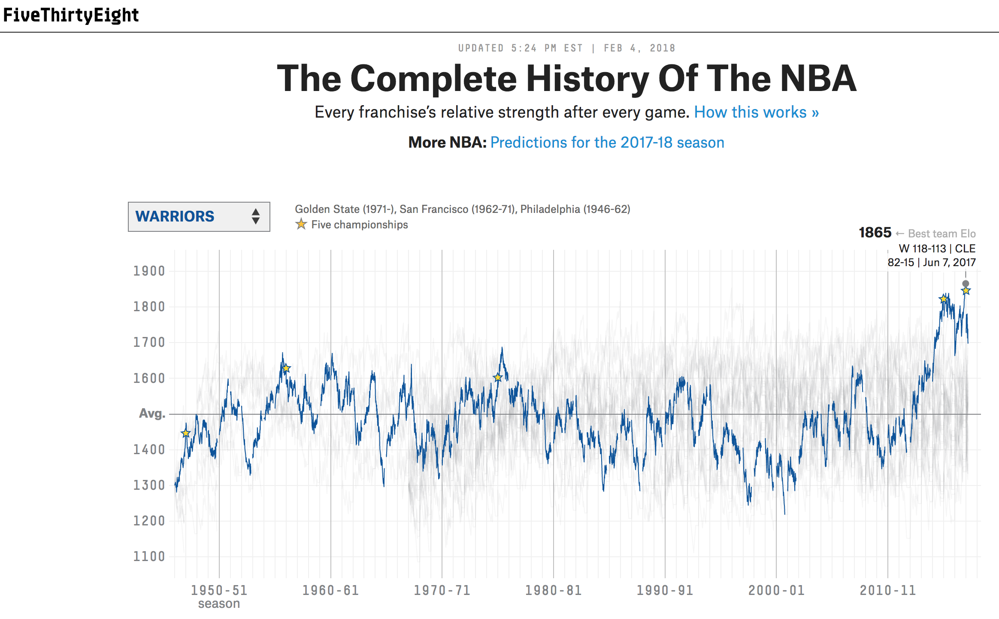

```{r setup, include = FALSE}
options(htmltools.dir.version = FALSE)
library(htmlTable)
```

# About Me

- Senior Data Scientist for Tennis Australia's Game Insight Group

- Research Fellow at Victoria University

- Tennis Blogger at [on-the-t.com](on-the-t.com)

- @StatsOnTheT


---

# Tutorial Resources

- Github: [github.com/skoval/satRday](github.com/skoval/satRday)

- Contact: [s.a.kovalchik@gmail.com](s.a.kovalchik@gmail.com)

---

# Tutorial Outline

Part 1. Sports data and packages

Part 2. Web scraping

Part 3. Data wrangling

Part 4. Modelling sports data

Part 5. Blogging

---


class: slide-img

<br>
<br>

.cbox[
### Part 1. Sports Data and Packages
]

---

# Common Types of Sports Data

- Box Scores

- Metrics

- Tracking data

---


<div align="center" style="margin-top: 10%;">

</div>


---


# Box Scores

A 'box score' is a generic term for the summary statistics reported about a single sporting event.

.hbox[
This is the most abundant type of sports data and the easiest to get your hands on.
]

---


<div align="center" style="margin-top: 10%;">

</div>


---

# Metrics

A lot of sports data is pre-summarized or the output of a statistical model that is used for further analysis. There are <i>derived</i> sports data.

- Game predictions

- Player ratings

- Betting odds

.hbox[
Metrics are most available for sports where the most statistical work is going on.
]

---

<div align="center" style="margin-top: 10%;">

</div>

---

class: slide-img

# Tracking Data

'Tracking data' describes spatial temporal data of objects in a sporting event.

.hbox[
This is most difficult data to get access to.
]

---

class: slide-img

# Getting Data

Here are some resources to directly download large amounts of sports data for free:

<br>

```{r echo = FALSE}
data <- data.frame(
  Resource = c("Open Source Sports", "Massey Ratings", "Washington Post", "Retrosheet", "Sean Lahman's Database"),
  Site = c("www.opensourcesports.com", "www.masseyratings.com/data.php", "stats.washingtonpost.com/cbk/teams.asp", "www.retrosheet.org/", "www.seanlahman.com/baseball-archive/statistics"),
  `Types of Data` = c("American team sports", "American Pro and collegiate sports", "Collegiate basketball", "Major league baseball", "Major league baseball")
)

cols <- c( "#fff", "#eeeeee")

htmlTable(data, 
          rnames = F, 
          col.rgroup = cols,
          css.cell = "text-align:left;")
```          
          
---

class: slide-img

# Packages

```{r echo = FALSE}
data <- data.frame(
  Sport = c("General", "", "", "Soccer", "Baseball", "", "Tennis", "Cricket"),
  Package = c("stattleshipR", "SportsAnalytics", "odds.converter",  "engsoccerdata", "pitchRx", "Lahman", "deuce", "cricketr!"),
  `What They Do` = c("Extract data for major American sports", "Historical soccer data", "Conversion functions for many types of odds", "Historical soccer data", "Scrape and visualize MLB gameday and pitch tracking data", "Historical baseball data", "Historical tennis data",  "Historical data and analytic tools for cricket")
)

cols <- c( "#fff", "#fff", "#fff", "#eeeeee", "#fff", "#fff", "#eeeeee", "#fff")

htmlTable(data, 
          rnames = F, 
          col.rgroup = cols,
          css.cell = "text-align:left;")
```

---

# Reality Check

For answering topical questions for our sport of interest, we will usually need to scrape data from the Web. 


That is the focus of the next part of the workshop...

<div style="padding:2%;" align="center" >

</div>
