```{r setup, include = FALSE}
options(htmltools.dir.version = FALSE)
library(htmlTable)
```


# About Me

- Senior Data Scientist for Tennis Australia's Game Insight Group

- Research Fellow at Victoria University

- Tennis Blogger at [on-the-t.com](on-the-t.com)

- @StatsOnTheT

---


.pull-left[

]

<!-- https://www.cbssports.com/mlb/news/athletics-gm-billy-beane-named-mlb-executive-of-the-year/ -->

.pull-right[

]


---

<div style="margin-left:5%;margin-top:10%;">
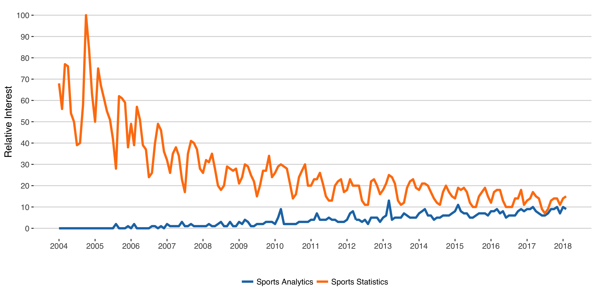
</div>


---

<div style="margin-left: 5%;margin-top: 10%;">
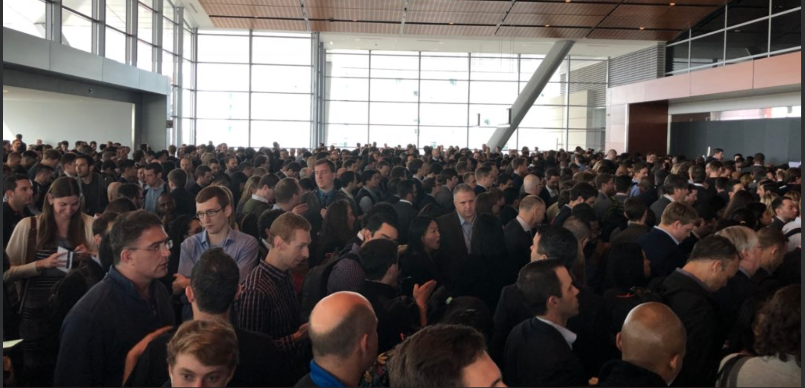
<p width=60%>Source: 2018 MIT Sloan Sports Analytics Conference</p>
</div>

---


.hbox[
## Tennis Analytics
]

---

<div style="margin-left: 15%;margin-top: 2%;">

<p width=60%>Source: 2012 MIT Sloan Sports Analytics Conference</p>
</div>


---

.pull-left[

]

.pull-right[
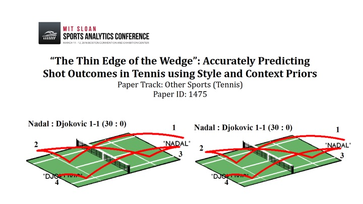
Source: 2016 MIT Sloan Sports Analytics Conference
]

---

<div style="margin-left:25%; margin-top:15%;">

</div>

---

# GIG Mission

.cbox[
## Revolutionise tennis through data science.
]


---

.hbox[
## GIG Data
]

---

# Data Sources

.pull-left[

]

.pull-right[

]

---

# Web Data


.pull-left[

]

.pull-right[
- Shot, point, and match-level performance data

- All pro matches since Open Era

- Automated Web scraping

- Stored in SQL database

- Main sources:
  - flashscore.com
  - tennisabstract.com
]

---

# Web Data


.pull-left[

]


.pull-right[
<div style="margin-top:25%;">
<h2>github.com/skoval/deuce</h2>
</div>
]

---

# Tracking Data


.pull-left[

]

.pull-right[
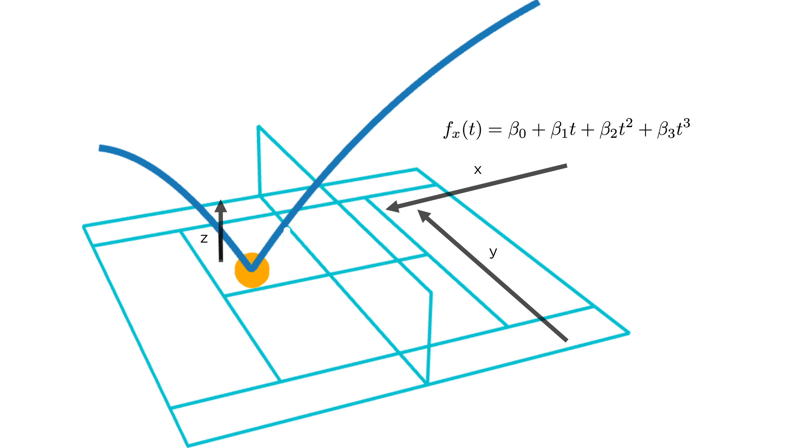
]

---

# Tracking Data


.pull-left[

]

.pull-right[
- Proprietary

- Ball and player trajectories

- Australian Open Series, 2012 to Present

- Real-time collection since 2017

- Stored in SQL database
]

---

.hbox[
## Event Operations
]

---

<div style="margin-left:10%;margin-top:5%;" />

</div>

---

<div style="margin-left:10%;margin-top:2%;" />
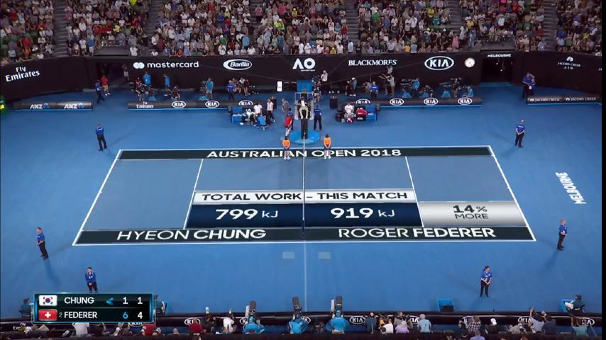
</div>

---

.pull-left[
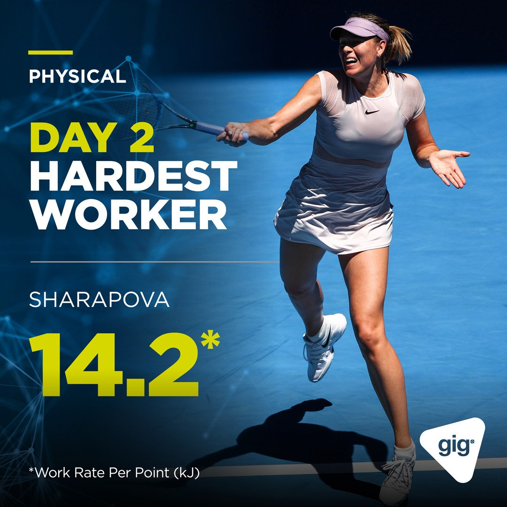
]

.pull-right[
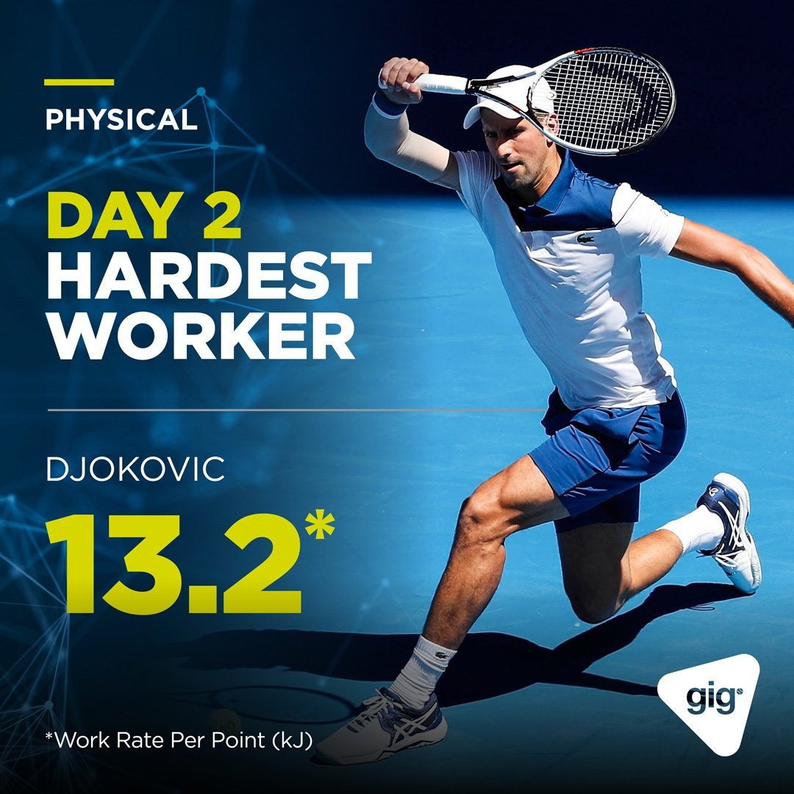
]

---

<div style="float:center;margin-top:2%;" />
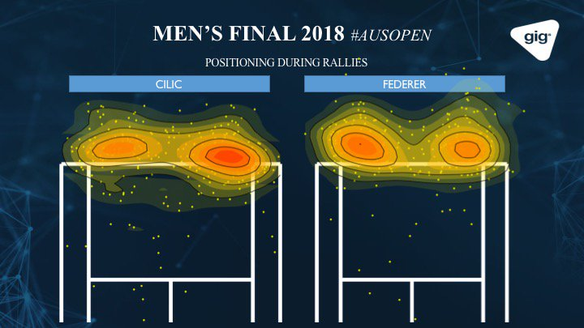
</div>

---

# How We Get There...

<div style="margin-left:10%;margin-top:1%;" />
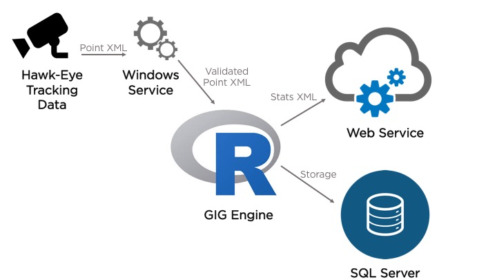
</div>

---

# Source XML: What We Get

<div style="float:center;margin-top:1%;" />
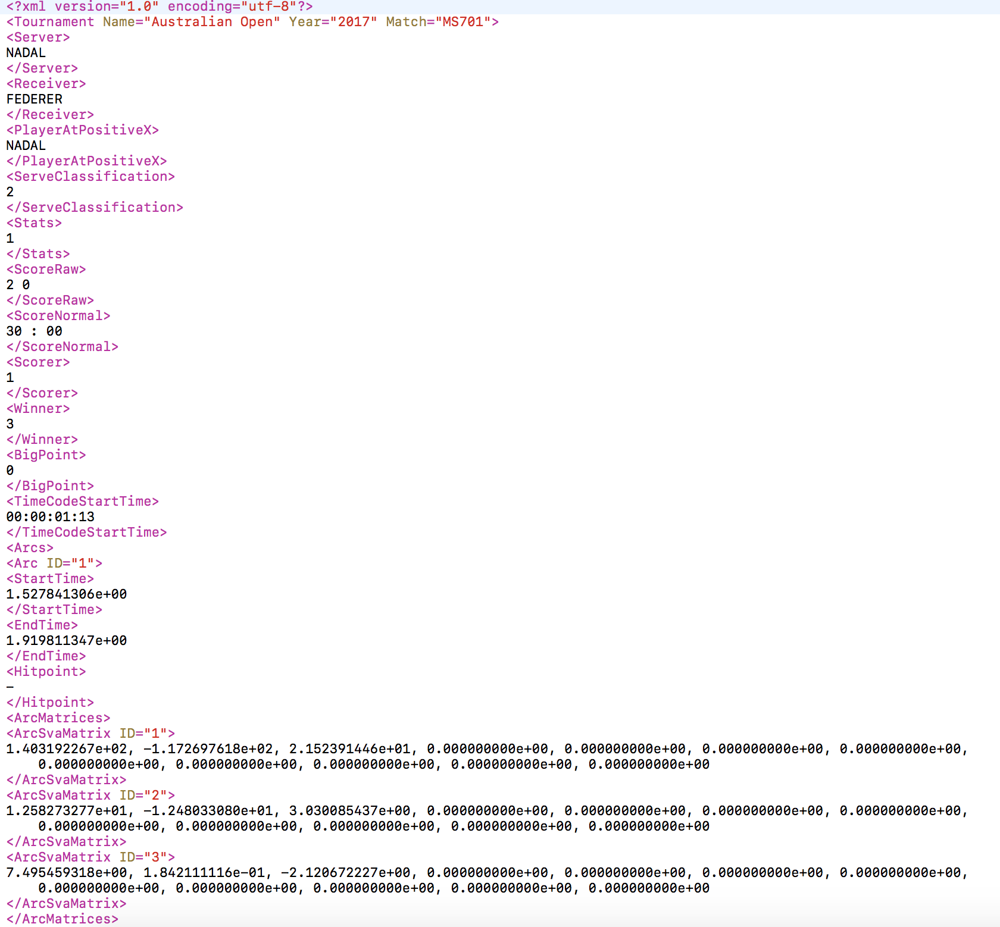
</div>

---

# Stats XML: What We Return

We derive point-level statistics on four dimensions of tennis using our own R package called the `GIGEngine`.

<div style="margin-left:10%; margin-top:1%;" />
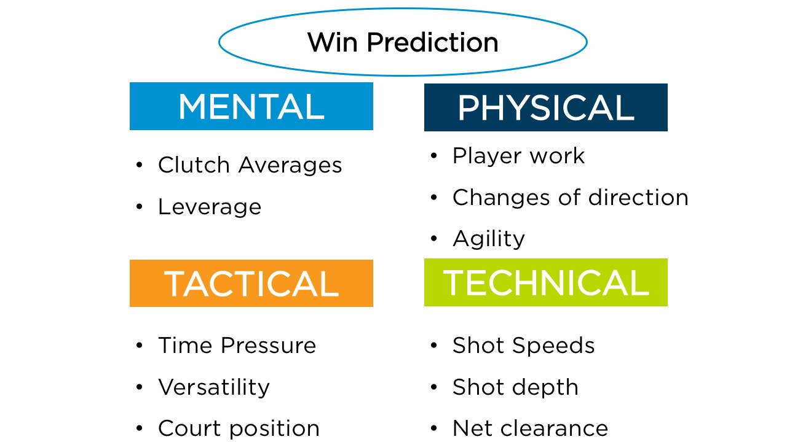
</div>


---

<h1 style="margin-top:20%;margin-left:20%;">Demo: Tour GIGEngine</h1>


---

# Modular Code

--

- You get some idea from the package layout that we break down our processes into small steps

--

- This is a key design principle to our code

--

- You can see this at work even better if we look at the main function that creates our 
XML output

---

[<h1 style="margin-top:20%;margin-left:15%;">Demo: Generating Output</h1>](file:///Users/skovalchik/Software/GIGEngine/R/complete_xml.R)

---


[<h1 style="margin-top:20%;margin-left:15%;">Demo: Wrapper for Automation</h1>](file:///Users/skovalchik/Software/GIGEngine/R/make_xml.R)

---

# Automation: Rscript

.pull-left[
- Real-time can't happen manually!

- Thankfully, `R` has a number of tools for command-line processing

- `Rscript` is one of these

- It's a linux/unix command to invoke R scripts that comes with base R
]

.pull-right[
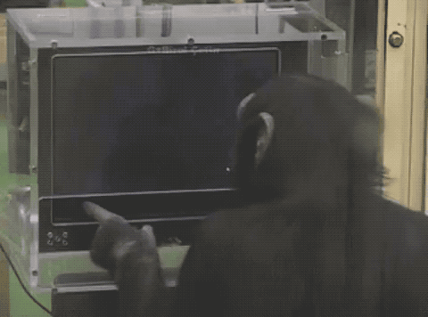
]

---

# Automation: Example

```{r eval=FALSE}
# Run file
library(GIGEngine)

args <- commandArgs(trailingOnly = TRUE)

xml.file <- args[1]
out.file <- args[2]
data.path <- args[3]
match.code <- args[4]

make_xml(
	xml.file = xml.file,
	out.file = out.file,
	data.path = data.path,
	match.code = match.code
)
```

--

```{r eval = FALSE}
Rscript --vanilla run.R <xml.file> <out.path> <storage.path> 
  <matchcode>
```


---


<h1 style="margin-top:20%;margin-left:30%;">Demo: Automation</h1>


---

# Delivering Output: Web Service

<div style="float:center;margin-top:0%;" />
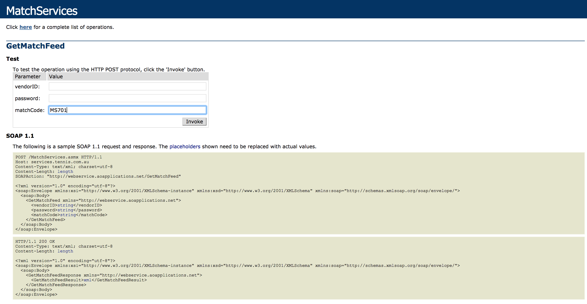
</div>

---

# Output XML

<div style="float:center;margin-top:1%;" />
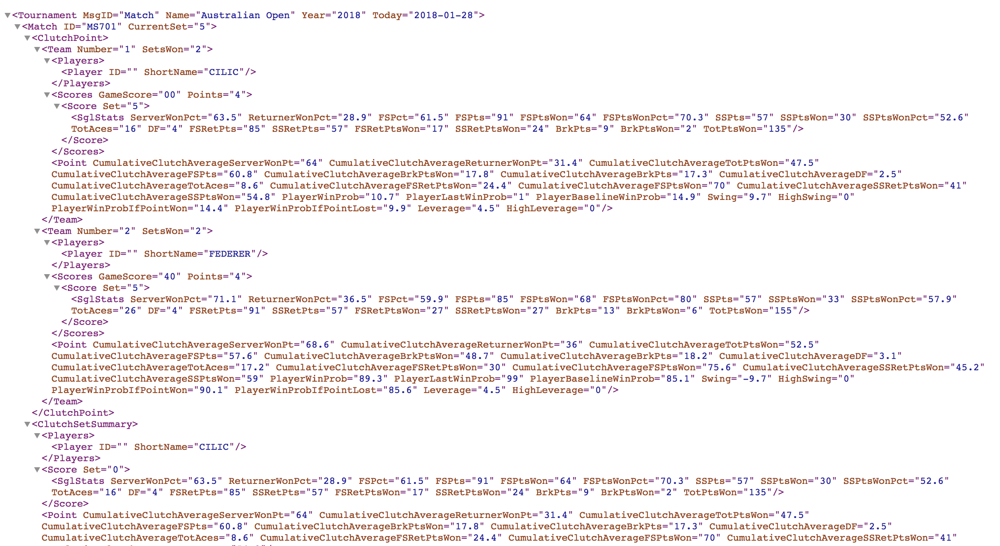
</div>

---

[<h1 style="margin-top:20%;margin-left:30%;">GIG Web Service</h1>](https://services.tennis.com.au/MatchServices.asmx?op=GetMatchFeed)

---

# Tips: R Software for Real Time

--

- Think modularly!

--

- Profile bottlenecks using `lineprof` package

--

- Embrace the tidyverse

--

- Further optimize with:

  - Fast handling of data.frames (e.g. `datatable`)
  - Parallel processing (`parallel`, `foreach`, etc.)
  - Write bottlenecks in C++ and use in R through `Rcpp`

---

# GIG Reports

<div style="float:center;margin-top:1%;" />
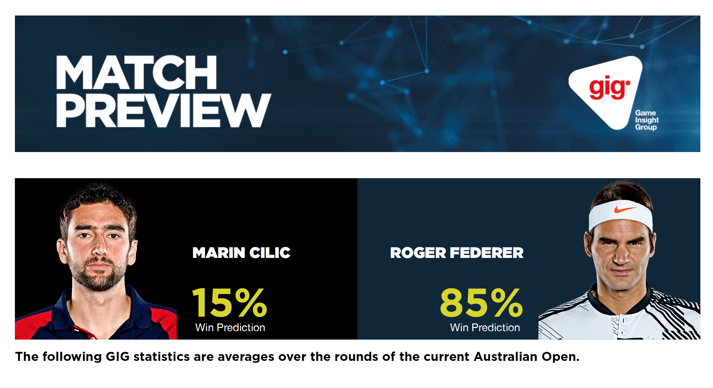
</div>

[Full Report](file:///Users/skovalchik/Software/GIGEngine/reports/previews_short/CILIC_FEDERER.pdf)

---


# GIG Reports

- Driven by `R` Markdown

- Automated with `Rscript`

- Multiple Reports for Media:
  - Player Profiles
  - Match Previews
  - Match Reviews
  
---

# Template

<div style="float:center;margin-top:0%;" />
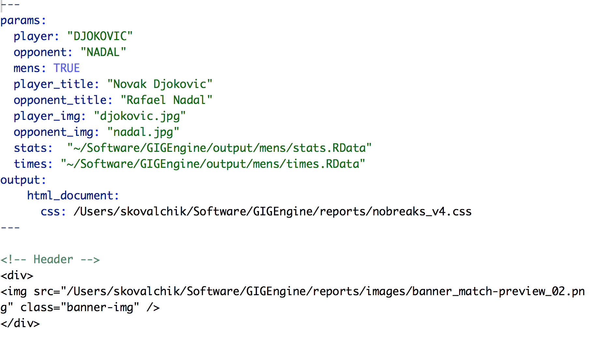
</div>

---


[<h1 style="margin-top:20%;margin-left:15%;">Demo: Match Report</h1>](file:///Users/skovalchik/Software/GIGEngine/reports/matchreports_short/match_review_report_short.Rmd)


---

# Match Report Script

```{r eval = F}
library(rmarkdown)

options(warn = -1)

args <- commandArgs(trailingOnly = TRUE)

arg1 <- args[[1]]

arg2 <- args[[2]]

arg3 <- args[[3]]

arg4 <- args[[4]]

rmarkdown::render("~/Software/GIGEngine/reports/matchreports_short/match_review_report_short.Rmd", params = list(player1 = arg4, player2 = arg3, matchid = arg1, filepath = arg2), output_file = paste(paste(gsub(" ", "_", arg3), gsub(" ", "_", arg4), sep = "_"), ".html", sep = "", collapse = ""), output_dir = "~/Software/GIGEngine/reports/matchreports_short/")
```

---


<h1 style="margin-top:20%;margin-left:15%;">Demo: Report Automation</h1>

---

# Tips: Real-time Rmarkdown

--

- Think of your document as a function

--

- Make your summaries & plots generalizable

--

- Separate content from style with a CSS style sheet 


---

# Making an Application Robust

.pull-left[
- Test, test, test!

- Anticipate how things can go wrong and build that into your testing

- If you are not sure what could go wrong, run a representative group of input through the process and document what goes wrong
]

.pull-right[
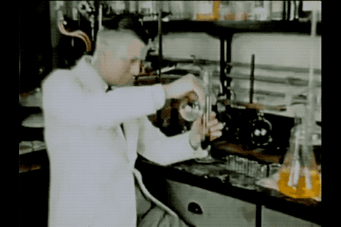
]

---

# Resources

- `Rscript`: https://stat.ethz.ch/R-manual/R-devel/library/utils/html/Rscript.html

- `lineprof`

- `datatable`

- Code Optimization: http://adv-r.had.co.nz/Performance.html

---

<div style="float:center;margin-top:10%;" />

</div>

