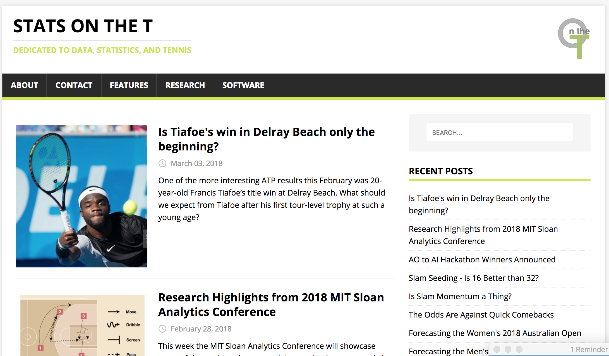
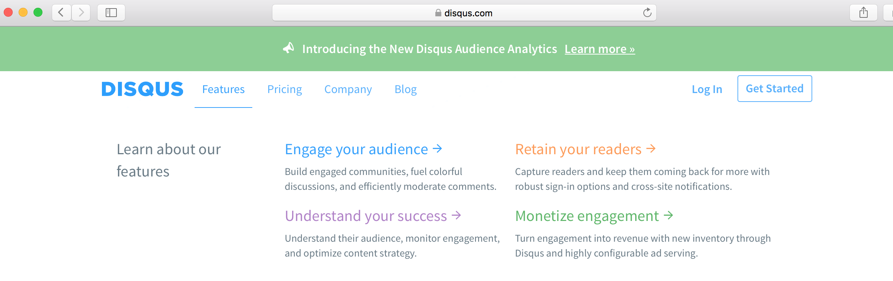
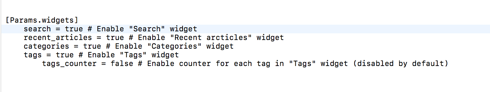
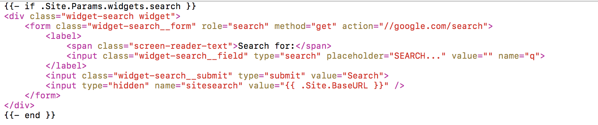
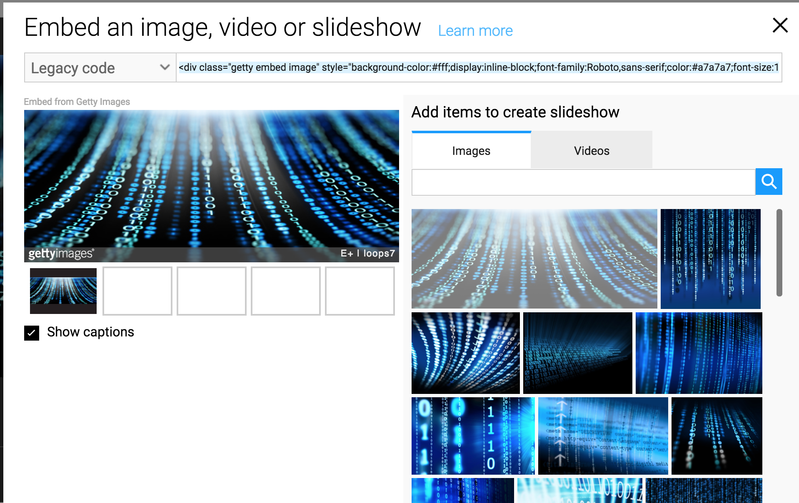
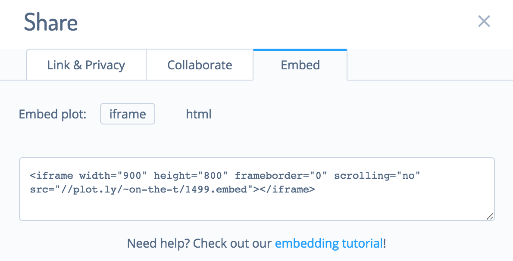
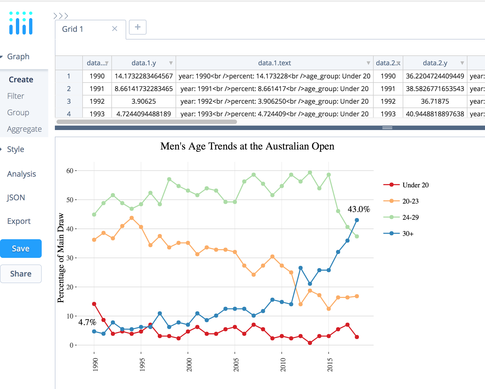

```{r setup, include = FALSE}
options(htmltools.dir.version = FALSE)

library(htmlTable)
```

class: slide-img


# About Me

.pull-left[
- Senior Data Scientist for Tennis Australia's Game Insight Group

- Research Fellow at Victoria University

- Tennis Blogger at [on-the-t.com](on-the-t.com)

- @StatsOnTheT
]

.pull-right[
<div style="margin-left:25%; margin-top:15%;">

</div>
]


---


### I get to help make cool stuff like this...


<div style="margin-left:10%;margin-top:5%;" />

</div>

---

# On The T




---


# Getting There

--

- Starting a blog might seem overwhelming but, if you know `R` and some basic CSS, it's easy

--

- Producing interesting content is the tough part about blogging

--

- `R` helps to let you focus on _content_ by providing easy-to-use tools that solve the technical details of going from code to the Web 


---

# Blogdown

--

* Package for writing a blog in R 

--

* Create content with R markdown

--

* Generate site with `Hugo`

--

* Deploy on Github, Netlify, or other hosting services

--

* Authored by Yihui Xie (who is at the conference!)


---

# What is Hugo?

.cbox[
### Hugo is a static Web site generator with heaps of custom themes that make it simple to create a beautiful site.
]

<br>
<br>
<br>

https://themes.gohugo.io

---

# About Hugo

* Hugo works with any operating system in the same way

* It handles many pages of content efficiently

* Hugo (like `R`) also has a very active user community

* *However*, Hugo is intended only for static sites where HTML content is fixed no matter what the user behavior

---

# Starting with Blogdown

Install from CRAN:

<br>

```{r eval = FALSE}
install.packages("blogdown")
```

<br>

Start reading the full book about working with Blogdown at https://bookdown.org/yihui/blogdown/

---


# Key Functions

Here are the major functions of `blogdown`.

```{r echo = FALSE}
data <- data.frame(
	Function = c(
	"install_hugo",
	"install_theme",
	"build_site",
	"html_page",
	"hugo_cmd",
	"new_content",
	"new_site",
	"serve_site"
	),
	Description = c(
		"Downloads and installs Hugo",
		"Downloads a Hugo theme from github",
		"Compiles Rmd files and builds the site",
		"Renders an Rmd file as an HTML that can be read by Hugo",
		"Run Hugo commands",
		"Creates new file in working directory",
		"Creates enviroment for new site",
		"Preview working version of your site"
	)
)


htmlTable(data, 
          rnames = F, 
          col.rgroup = c("#fff", "#eeeeee"),
          align = "ll",
          css.cell = "padding:2%;")
```


---

# Example Workflow

1. Create a repo for your blog on Github (you need to have an account). Here is my example:

<div align="center">

</div>

---

# Example Workflow


2. Choose a directory for your repo and clone it there. Here, I put my repo under the path `/Software`:

<br>


---

# Set Server Daemon

--

- By default, when running your site locally, your `R` session will be blocked

--

- To prevent this, you can use change your options `options(servr.daemon = FALSE)`

--

- You can do this at the start of each blogging session 

--

- _Or_ fix it permanently in your `.Rprofile` file

---

# Example Workflow


3. In `R`, load `blogdown`

4. Install Hugo

5. `setwd` into the repo directory and create a new site

```{r eval = FALSE}
library(blogdown)

install_hugo() # On a Mac you need homebrew

options(servr.daemon = FALSE) # If not in Rprofile

# setwd() to blog directory

new_site()
```

---

# Starting Site

You should see a browser open with the following default layout:


---

# Site Folders

Also, if you look under your blog repo, you will see that a number of new folders were created. These are all the elements needed to get your site up and running.


---


# Choosing a New Theme


* The default theme for the site is `Lithium`

* To set your own style, you can choose from hundreds of other themes
 at [themes.gohugo.io](http://themes.gohugo.io/) 
 
* When you find one you like you can add it to your site with `install_theme`

<div align="center">

</div>


---

# Example: Install Theme

In this example, I add theme `mainroad`:

```{r eval = FALSE}
install_theme('vimux/mainroad',
	theme_example = TRUE, 
	update_config = TRUE
)
```

---

# Example: Install Theme

I can preview the site with the `serve_site`. Here is what the new theme looks like:


---

# Configuring Site

In your blog repo, you will see a `config.toml` file. This is where you can update the elements on your main page (which will be `index.html`). Below I've highlighted some fields to update with the `Mainroad` config file.

<div align="center">

</div>


---

# New Configuration 


---

# Updated Site


---

# Creating New Post

You can generate new posts in R markdown (or markdown) files using `new_post`. Here is an example.

```{r eval = FALSE}
new_post(
	title = "French Open 2017",
	kind = "default"
)
```

---

# Creating a New Post

This will open an editor, where you can enter any additional meta-data and start to create content, just like you would with `R` markdown.


---

# Location of New Post

The post will exist under the `content/post` folder.


---

# Site Update

If you have your interactive session open, the site will automatically update with the post.


---

# Deploying

1. When you are ready to publish your site, you can use the `build_site(local = FALSE)` function, which compiled Rmd and runs Hugo to prepare your site for publication.

2. You will need to select a service for hosting your site. There are many options, like:
  - [Netlify](https://www.netlify.com/)
  - [Github IO](https://pages.github.com/)
  - [Updog](https://updog.co/)
  
3. When you have a domain, you will need to update `baseurl` in your config before running `build_site`.

---

# Useful Add-ons

1. Contact page

2. Comments

3. Google search

---

# Contact

For a simple page with your email contact, you can create a markdown file like so:


--

- Store under content/post

- Use the menu 'main' to make it appear on the main page menu

---

# Comments

Comments aren't the greatest thing the Internet has given us but you may still want feedback from readers on your site

- `Disquis` is a popular comment service provider

- Many Hugo themes like Mainroad provide automatic support

- Just register your page there and then update your `config.toml`

<div style="margin-left:15%;">

</div>

---

# Google Search

- Once you are building content, it is a good idea to give your readers the ability to search content on your site

- One way to do this is with Google site search 

- Many themes will have built-in widgets to incorporate this search


<br>
<br>
<br>

*Note:* It can take a day or so for the site index to begin to populate

---

# Search Configuration



---

# Search Widget

Under layouts/partials/widgets in Mainroad theme...



---

# Embedding Visuals

.pull-left[
<br>
<br>
<br>

- `img src` for local images

- `iframe` for third party images
]

.pull-right[

]

---

# Static

- Sometimes you might create an image outside of R markdown that you want to include on your site

- You can store these under 'public/img'

- These can then be invoked with standard 'img src'

<br>
<br>

```{r eval = FALSE}
<div style="float:right;padding:2%;">

</div>
```

---

# Third Party Images

These are images that exist on the Web. Some common types you might consider including are:

- Getty images

- Plotly charts

- Entire shiny apps!

--

<br>
<br>

<i>All of this can be done with iframes!</i>


---



---




---



---

# The Real Challenge


The technicalities of setting up a blog are the easy part

--

<br>

Creating a steady stream of interesting content is the <i>real</i> challenge

--

<br>

I can't claim to have mastered this but I can share some lessons I've learned that can at least help <i>you</i> get there

---

# Lesson 1

.hbox[
### Set an achieveable goal for the frequency you write.
]

--

- I will write whenever I am inspired 

--

- But sometimes inspiration doesn't come and I still need to push myself to write

--

- For this reason, I set a target for muself to write once a week, recognizing that this would be a challenge at times but still not beyond what my time/creativity allows

---


# Lesson 2

.hbox[
### A writing routine can help.
]

--

- When I am in my weekly mode, I will often do analysis and a draft on Friday afternoon

--

- I will then re-read and publish on Saturday

--

- Having a break before final edits is a good way to catch typos or awkward phrases that you might not have noticed on first read

---

# Lesson 3

.hbox[
### Find inspiring outlets for topical ideas.
]

--

- I have a number of outlet for keeping up topical themes in tennis:
  
  - Other blogs
  - RSS feeds
  - Podcasts
  - Forums
  
- Read with a curious mind and always ask where data could contribute to a topic of interest
  
---

# Lesson 4

.hbox[
### Know where you can get data that is relevant to your blog.
]

--

- I didn't start my blog until I had written an R package that collated multiple sources of tennis data from the Web

- This made it so easy to speak to a lot of questions that would come up in the press with a data analysis

- So it is good to do some data homework before you launch your blog

---

# Lesson 5

.hbox[
### If I can't chart something in a post, it probably isn't a great post.
]


-- 

- This is a rule of thumb I found that helps me gauge what is a 'good' post

- It might not be the right rule for you, but if you are launching a data science blog, I would recommend you consider it

---

# Lesson 6

.hbox[
### Think quality over quantity. 
]

--

- It is not a universal rule, but often, shorter posts are the most engaging to readers

- Being more concise can also help us sharpen our thoughts

- Aiming for ~800 words or less is a good rule of thumb


---

# Lesson 7

.hbox[
### Celebrate each post with something special.
]

--

- I usually go for a nice walk and coffee after my Saturday writing

--

- This makes getting through the writing process that much more rewarding

--

- Maintaining an engaging blog isn't easy so you shouldn't be shy to celebrate each post you put out there in some way that works for you

---

# Lesson 8

.hbox[
### Don't doubt, just write!
]

--

- I wanted to start a blog for almost a year before I actually started

--

- There are a thousands of ways to talk yourself out of getting started

--

- But for every excuse that comes up in your mind, your answer should always be: 'Just write!'

---

# Resources

- [blogdown](https://bookdown.org/yihui/blogdown/)
  - https://bookdown.org/yihui/blogdown/

- [Git Commands](https://confluence.atlassian.com/bitbucketserver/basic-git-commands-776639767.html)
  - https://confluence.atlassian.com/bitbucketserver/basic-git-commands-776639767.html


